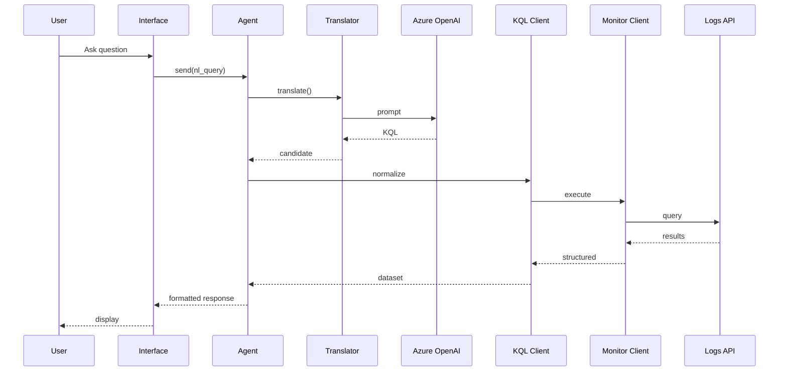

# Azure Monitor MCP Agent

A comprehensive Python agent for querying Azure Monitor Log Analytics using both direct KQL and natural language (NL) questions. Features multiple interfaces including CLI, web UI, REST API, and MCP server integration for AI assistants.

## 🌟 Features
- **Multiple Interfaces**: CLI, Beautiful Web UI, REST API, and MCP Server
- **Natural Language Queries**: Ask questions in plain English, get KQL results
- **Enhanced Table Display**: Beautiful HTML tables with professional styling (NEW!)
- **Smart Retry Logic**: Automatic retries improve translation success rates
- **Smart Timespan Detection**: Automatically handles queries with time filters
- **Example-Driven Translation**: Uses curated KQL examples for accurate translations
- **Azure OpenAI Integration**: Powered by Azure OpenAI with o4-mini model support
- **Real-time Results**: Interactive web interface with live query execution
- **Workspace Management**: Easy setup and connection testing
- **Defensive Error Handling**: Robust error handling and result parsing

## Requirements
- Python 3.8+
- Azure CLI (for authentication)
- Azure Log Analytics Workspace
- Azure OpenAI resource (for NL-to-KQL translation)

## Installation
1. Clone this repository and enter the directory:
   ```powershell
   git clone <your-repo-url>
   cd NoaAzMonAgent
   ```
2. Install dependencies:
   ```powershell
   pip install -r requirements.txt
   ```
3. Set environment variables for Azure OpenAI (see code comments for required variables).

## 🚀 Quick Start

### 1. **Web Interface** (Recommended)
The easiest way to get started with a beautiful, interactive web interface:

```powershell
# Install dependencies
pip install -r requirements.txt

# Launch web interface
python web_app.py
```

Then open your browser to **http://localhost:8080** and enjoy the modern web UI!

**Web Interface Features:**
- 🎨 Beautiful, responsive design
- 💬 Natural language question input
- 🔗 Interactive workspace setup
- 💡 Quick suggestion pills
- 📚 Built-in example queries
- ⚡ Real-time results display
- 🧪 Connection testing

### 2. **Command Line Agent**
For terminal-based interactions:

```powershell
python server_manager.py agent
```

### 3. **Server Interfaces**

#### REST API Server
```powershell
python server_manager.py http
# Available at http://localhost:8080
```

#### MCP Server (for AI assistants like Claude)
```powershell
python server_manager.py mcp
```

## 💻 Usage Examples

### Web Interface
1. Start the web interface: `python web_app.py`
2. Enter your Log Analytics Workspace ID
3. Click "Connect" to setup the workspace
4. Ask questions like:
   - "Show me failed requests from the last hour"
   - "What are the top 5 slowest API calls?"
   - "Get heartbeat data from the last 30 minutes"

### CLI Examples
Run a KQL query directly:
```powershell
python main.py query --workspace-id <WORKSPACE_ID> --query "Heartbeat | take 5"
```

Ask a question in natural language:
```powershell
python main.py query --workspace-id <WORKSPACE_ID> --ask "Show me the total ingestion volume in MB in the last 24 hours"
```

### REST API Examples
```bash
# Execute a KQL query
curl -X POST http://localhost:8080/query \
  -H "Content-Type: application/json" \
  -d '{"workspace_id": "your-workspace-id", "query": "Heartbeat | take 5"}'
```

## 🔧 Setup & Configuration

### Prerequisites
- **Python 3.8+**
- **Azure CLI** (for authentication)
- **Azure Log Analytics Workspace**
- **Azure OpenAI resource** (for natural language translation)

### Installation
1. **Clone and setup:**
   ```powershell
   git clone <your-repo-url>
   cd NoaAzMonAgent
   pip install -r requirements.txt
   ```

2. **Azure authentication:**
   ```powershell
   az login
   ```

3. **Configure Azure OpenAI:**
   ```powershell
   # Copy template and edit with your details
   copy .env.template .env
   # Edit .env with your Azure OpenAI endpoint and API key
   ```

4. **Test setup:**
   ```powershell
   python setup_azure_openai.py
   ```

### Unified Schema Caching & Table Listing (Optional)
The agent can enumerate workspace tables using the official Log Analytics Tables REST API for faster and more complete schema hydration. Provide these environment variables (PowerShell shown):

```powershell
$env:LOG_SUBSCRIPTION_ID = "<subscription-guid>"
$env:LOG_RESOURCE_GROUP  = "<resource-group-name>"
$env:LOG_WORKSPACE_NAME  = "<workspace-resource-name>"  # This is the workspace resource name, not the GUID workspace ID
# Optional: override default 20 minute cache TTL
$env:SCHEMA_TTL_MINUTES  = "20"
```

Behavior:
- If the REST call succeeds, schema source is reported as `rest-api`.
- If REST fails or required vars are missing, it falls back once to a lightweight union query enumeration (`union-query`).
- Results (table list + manifest map) are cached for the TTL to avoid repeated enumeration.

You can safely omit these vars for development; the fallback still works, just with slightly more overhead.

## 🏗️ Architecture

### Components
- **Web Interface** (`web_app.py`): Modern Flask-based web UI
- **CLI Agent** (`logs_agent.py`): Command-line natural language interface
- **Translation Engine** (`nl_to_kql.py`): NL-to-KQL conversion
- **REST API** (`my-first-mcp-server/rest_api.py`): HTTP API server
- **MCP Server** (`my-first-mcp-server/mcp_server.py`): AI assistant integration

### High-Level Architecture Diagram

```mermaid
%% See project_summary/01_high_level_architecture.mmd for source
flowchart LR
   subgraph Interfaces
      UI[Flask Web UI]
      REST[REST API]
      CLI[CLI / Server Manager]
      MCP[MCP Server]
   end
   subgraph Core Agent
      AGENT[KQLAgent]
      TRANS[NL→KQL]
      KQLC[KQL Client]
      MONC[Monitor Client]
   end
   subgraph Azure
      AOAI[Azure OpenAI]
      AMON[Azure Monitor Logs]
   end
   subgraph Knowledge
      EX[Examples]
      META[Metadata]
      CFG[Config]
   end
   Interfaces --> AGENT
   AGENT --> TRANS --> AOAI
   AGENT --> KQLC --> MONC --> AMON
   AGENT --> EX
   AGENT --> META
   CFG --> AGENT
```


### Request Sequence Diagram


More docs & modular diagrams: see `project_summary/` directory.

### Smart Features
- **Intelligent Timespan Detection**: Automatically detects time filters in queries
- **Example-Driven Translation**: Uses curated KQL examples for accurate translations
- **Defensive Error Handling**: Robust error recovery and user feedback
- **Multiple Authentication**: Azure CLI, managed identity, service principal support

## 📚 Example Categories

The system includes curated examples for:
- **App Requests** (`app_requests_kql_examples.md`): HTTP request analysis
- **App Exceptions** (`app_exceptions_kql_examples.md`): Error and exception tracking
- **App Traces** (`app_traces_kql_examples.md`): Application trace analysis
- **App Dependencies** (`app_dependencies_kql_examples.md`): External service monitoring
- **Performance** (`app_performance_kql_examples.md`): Performance metrics
- **Usage Analytics** (`usage_kql_examples.md`): Usage patterns and statistics

## 🛠️ Available Commands

```powershell
# Server management
python server_manager.py web        # Start web interface
python server_manager.py agent      # Start CLI agent
python server_manager.py http       # Start REST API server
python server_manager.py mcp        # Start MCP server
python server_manager.py test       # Test functionality

# Direct launchers
python web_app.py                   # Launch web interface
python logs_agent.py                  # Start CLI agent directly
```

## 🔍 Troubleshooting

### Common Issues
- **Import errors**: Run `pip install -r requirements.txt`
- **Authentication failures**: Check `az login` status
- **Translation errors**: Verify Azure OpenAI configuration in `.env`
- **Connection issues**: Test with built-in connection testing tools

### Debug Tools
- `python test_translation.py` - Test NL-to-KQL translation
- `python test_mcp_server.py` - Test MCP server functionality  
- `python setup_azure_openai.py` - Verify Azure OpenAI setup

## 🔐 Security
- **Environment Variables**: Never commit `.env` files with secrets
- **Azure RBAC**: Use Azure role-based access control for workspace access
- **API Key Management**: Rotate Azure OpenAI keys regularly
- **Network Security**: Use private endpoints for production deployments

## 📖 Documentation
- **[Web Interface Guide](WEB_INTERFACE_GUIDE.md)**: Comprehensive web UI documentation
- **[KQL Examples](app_requests_kql_examples.md)**: Browse curated query examples
- **Setup Guides**: Step-by-step configuration instructions

### Prompting & Ontology (AKS / Container Logs)
The project now includes a structured prompt system for AKS container log analytics:

- Core system prompt: `prompts/system_base.txt`
- Domain capsule (compressed ontology): `prompts/domain_capsule_containerlogs.txt`
- Few-shot examples: `prompts/fewshots_containerlogs.txt`
 - KQL helper functions: `docs/containers_capsule/kql_functions_containerlogs.kql`
 - Ontology & semantic model: `docs/containers_capsule/container_ontology.md`
- Prompt builder utility: `prompt_builder.py`

Build a composite prompt from a natural language query:
```powershell
python prompt_builder.py "why are there so many errors in payments last 2h?"
```
Output includes assembled prompt + JSON metadata (schema version, hashes, output mode).

Prompt layering reduces token usage and prevents knowledge drift by separating:
1. System safety rules
2. Domain capsule summary
3. Function index (names only)
4. Dynamic context addendum (keyword heuristics)
5. Clarified user query
6. Output directive (KQL-only vs Explanation+KQL)

Regenerate / adjust capsule or few-shots as ontology evolves.

## 🤝 Contributing
1. Fork the repository
2. Create a feature branch
3. Make your changes
4. Add tests for new functionality
5. Submit a pull request

### Documentation & Diagram Workflow
- Edit individual section files under `project_summary/`.
- Mermaid sources live as `.mmd` files for portability and tooling.
- (Optional) Export SVG/PNG for embedding (see script below).

#### Why export to SVG?
While GitHub renders Mermaid blocks, exporting to SVG provides:
- Stable artifacts for wikis, slide decks, PDFs, or external portals lacking Mermaid support.
- Version-controlled visuals immune to renderer changes.
- Faster load in environments that block client-side Mermaid rendering.
- Ability to annotate or post-process (e.g., add callouts in vector editors).

#### Quick Export (requires Node.js)
```powershell
npm install -g @mermaid-js/mermaid-cli
mmdc -i project_summary/01_high_level_architecture.mmd -o project_summary/01_high_level_architecture.svg
mmdc -i project_summary/04_sequence_diagram.mmd -o project_summary/04_sequence_diagram.svg
```

Or run the helper script (after creation): `powershell -ExecutionPolicy Bypass -File scripts/export-diagrams.ps1`.

## 📝 License
MIT License - see LICENSE file for details

## 🌟 Features Highlights

### ✅ Recently Added
- **🌐 Beautiful Web Interface**: Modern, responsive web UI
- **🧠 Smart Timespan Detection**: Automatic time filter handling
- **🔧 Enhanced Translation**: Improved NL-to-KQL accuracy
- **🤖 MCP Server Integration**: AI assistant compatibility
- **📱 Mobile-Responsive**: Works on all devices

### 🚀 Coming Soon
- Query history and favorites
- Advanced result visualization
- Team collaboration features
- Export capabilities (CSV, JSON)
- Custom dashboard creation

---

**Happy querying! 🎉**

> **Tip**: Start with the web interface for the best experience, then explore the CLI and API options for automation and integration needs.

## 📊 Enhanced Table Display

The web interface now features **beautiful HTML table rendering** instead of plain text results:

### Key Features:
- 🎨 **Professional Styling**: Gradient headers, hover effects, responsive design
- 📊 **Multi-Table Support**: Handle complex queries returning multiple result sets
- 📝 **Query Context**: Shows the generated KQL query alongside results
- 🔍 **Smart Formatting**: Automatic type detection for numbers, booleans, and nulls
- 📱 **Mobile Responsive**: Tables adapt to different screen sizes
- ↕️ **Scrollable Results**: Large datasets with vertical scrolling
- 📈 **Table Statistics**: Shows row/column counts and data insights

### Before vs After:
**Before (Plain Text):**
```
Table 1 (3 rows):
Name | Success | Duration
-----|---------|----------
API1 | True    | 245
API2 | False   | 5000
```

**After (HTML Table):**
- Beautiful gradient headers
- Professional row styling
- Interactive hover effects
- Responsive mobile design
- Color-coded data types

**📚 See:** `TABLE_DISPLAY_GUIDE.md` for complete documentation
