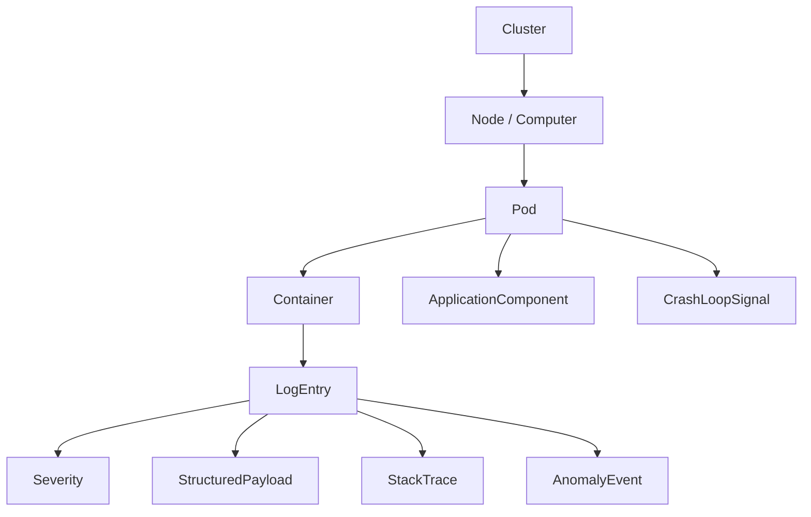

# Azure Monitor Containers Ontology & Semantic Model

This document captures the ontology, semantic model, and reusable KQL building blocks for `ContainerLogV2` and related enrichment sources in AKS environments.

## 1. Table Overview
Primary table: `ContainerLogV2` (successor of `ContainerLog`). Provides stitched, multi-line aware, JSON-capable log entries for Kubernetes-managed containers.

### Core Columns
- **Computer**: Node name
- **ContainerId**: Runtime container ID
- **ContainerName**: Pod container logical name
- **PodName**: Kubernetes pod name
- **PodNamespace**: Pod namespace
- **LogMessage (dynamic)**: Full log entry (string or JSON object)
- **LogSource**: stdout | stderr
- **TimeGenerated**: UTC timestamp
- **KubernetesMetadata (dynamic)**: podUid, podLabels, podAnnotations, image data
- **LogLevel**: CRITICAL | ERROR | WARNING | INFO | DEBUG | TRACE | UNKNOWN

## 2. Conceptual Ontology
Entities:
- Cluster, Node, Pod, Container, LogEntry, Severity, StructuredPayload, StackTrace, ApplicationComponent, WorkloadController, CrashLoopSignal, AnomalyEvent.

```
Cluster
 ├─ Node (Computer) ──┬─ Pod ──┬─ Container ──┬─ LogEntry
 │                    │        │               ├─ Severity
 │                    │        │               ├─ StructuredPayload
 │                    │        │               └─ StackTrace (optional)
 │                    │        └─ ApplicationComponent (labels)
 │                    └─ CrashLoopSignal (derived)
 └─ AnomalyEvent (derived from LogEntry aggregations)
```

## 3. Mermaid Diagram


## 4. Derived Field Recipes
| Field | Expression |
|-------|-----------|
| PodUid | `tostring(KubernetesMetadata.podUid)` |
| PodLabels | `KubernetesMetadata.podLabels` |
| WorkloadName | `coalesce(Labels['app.kubernetes.io/name'], Labels['app'], Labels['service'], PodName)` |
| IsError | `LogLevel in~ ('CRITICAL','ERROR') or LogSource == 'stderr'` |
| PlainTextMessage | `iff(typeof(LogMessage)=='string', tostring(LogMessage), tostring(LogMessage.message))` |
| IsStructured | `typeof(LogMessage)=='dynamic' and bag_keys(LogMessage) != []` |
| LatencyMs | `toint(extract('latency[=:]\\s?([0-9]+)ms',1,Plain))` |
| StackTracePresent | Keywords or JSON key 'stack' |

## 5. Sample KQL Blocks
### Error Rate Per Workload
```kusto
ContainerLogV2
| where TimeGenerated > ago(1h)
| extend Labels = KubernetesMetadata.podLabels
| extend WorkloadName = tostring(coalesce(Labels['app.kubernetes.io/name'], Labels['app'], PodName))
| extend IsError = LogLevel in~ ('CRITICAL','ERROR') or LogSource == 'stderr'
| summarize Errors=countif(IsError), Total=count() by WorkloadName, PodNamespace
| extend ErrorRatePct = 100.0 * Errors / iff(Total==0,1,Total)
| top 20 by ErrorRatePct desc
```

### Latency Extraction (>500ms)
```kusto
ContainerLogV2
| where TimeGenerated > ago(1h)
| extend Plain = tostring(LogMessage)
| extend LatencyMs = toint(extract('latency[=:]\\s?([0-9]+)ms',1, Plain))
| where LatencyMs > 500
| project TimeGenerated, PodName, ContainerName, LatencyMs, Plain
```

### Structured JSON Status Filtering
```kusto
ContainerLogV2
| where typeof(LogMessage)=='dynamic'
| where tostring(LogMessage.status) == '500'
| project TimeGenerated, PodName, ContainerName, LogMessage
```

### Stack Trace Detection
```kusto
ContainerLogV2
| where TimeGenerated > ago(1d)
| extend Plain = tostring(LogMessage)
| where Plain has_any ('Exception','Traceback',' at ')
| summarize TraceLines=count() by ContainerName, PodNamespace
```

### Noisy Containers (Top Log Volume)
```kusto
ContainerLogV2
| where TimeGenerated > ago(1h)
| summarize Lines=count() by ContainerName, PodNamespace
| top 20 by Lines desc
```

## 6. Crash Loop Correlation Example
```kusto
KubePodInventory
| where TimeGenerated > ago(1h)
| summarize MaxRestarts=max(RestartCount) by PodName, Namespace
| join kind=inner (
  ContainerLogV2
  | where TimeGenerated > ago(1h)
  | extend IsError = LogLevel in~ ('CRITICAL','ERROR') or LogSource=='stderr'
  | summarize RecentErrors=countif(IsError) by PodName, PodNamespace
) on $left.PodName == $right.PodName and $left.Namespace == $right.PodNamespace
| order by RecentErrors desc
```

## 7. Intent Mapping
| Intent | Indicators | Strategy |
|--------|-----------|----------|
| Error Rate | "error rate", "failures" | Aggregate IsError by workload/time bucket |
| Crash Loop | "crash", "restart" | Join restarts + error spikes |
| Latency | "slow", ">500ms" | Extract latency numeric fields |
| Volume | "chatty", "noisy" | Count log lines per workload |
| Stack Traces | "exceptions" | Pattern match / keyword heuristic |
| Status Code | "500 errors" | JSON field filter |

## 8. Heuristics Checklist
1. Default timeframe last 1h.
2. Derive workload name via labels priority.
3. Distinguish structured vs plain.
4. Provide counts + rates.
5. Use bin(TimeGenerated, 5m) for trends.
6. Include units.
7. Clarify assumptions.
